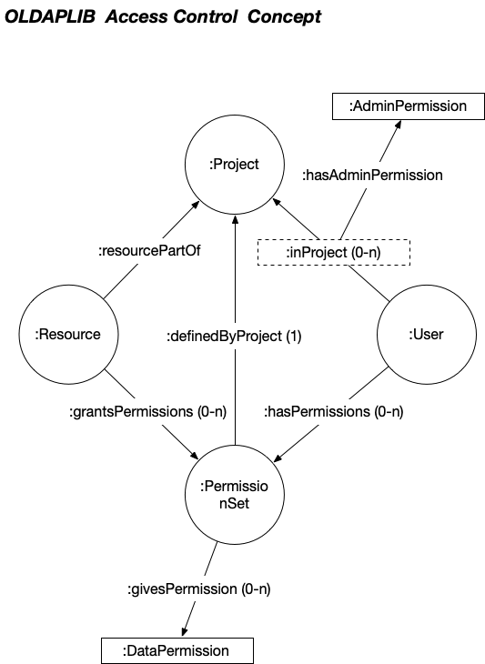

# OLDAP Permission Concept

In OLDAP, not every user is allowed to do everything. A simple but efficient permission concept
allows to control which user has which permission to modify the data in OLDAP. Basically the following
permission structure is implemented:

There are two kinds of permissions that have to be defined to OLDAP users:

## Administrative permissions

- `ADMIN_OLDAP`: Quasi "root"-permissions, system administration
- `ADMIN_USERS`: add/modify/delete users.
- `ADMIN_PERMISSION_SETS`: add/modify/delete permission sets
- `ADMIN_RESOURCES`: _Override_ resource permissions to manipulate any resources within the given project
  (All CRUD-operations)
- `ADMIN_MODEL`: User has permission to modify the data model.
- `ADMIN_CREATE`: The user is allowed to _add_ new resources.

Administrative resources are attached to the RDF-triple that defines the
membership of a user to a project using the RDF*star syntax:

```rdf
ex:NikolaiTesla a :User .
ex:Electrify a :project .

ex:NikolaTesla :inProject ex:Electrify .
<<ex:NikolaTesla :inProject ex:Electrify>> :hasPermission :ADMIN_MODEL
<<ex:NikolaTesla :inProject ex:Electrify>> :hasPermission :ADMIN_USER
<<ex:NikolaTesla :inProject ex:Electrify>> :hasPermission :ADMIN_CREATE
```

Above example would the user ex:NikolaTesla would have the permission to modify
the data model of ex:Electrify, to add/modify/delete users and to create new
resources. 

## Data Permissions

Data permissions are used to define the access rights to the actual resources
representing the data. The data permission concept is based on the `:PermissionSet` which
are granted the access permissions. Each resource grants the access permissions based on
the connection to one or many permission sets using the `:grantsPermissions`-property. A
given user is member of one or many groups based on the `:hasPermissions`-property.
The permission set itself uses `:gives` to list the permissions in the given set.  
**NOTE**: A permission set should give all the required permission! The `EXTEND` permission
does *not* automatically also give the `VIEW`-permission! The reason are performance
issues. However, a GUI should automatcally include `VIEW` and `EXTEND`, if a permission
set is given the `UPDATE`-permission!

The following data permissions are available:

- `DATA_RESTRICTED`: A resticted view of the resource
- `DATA_VIEW`: Readonly access to a resource
- `DATA_EXTEND`: Allows to extend the data (e.g. adding a comment or annotation or
  adding data to a filed that has a cardinality greater one).
- `DATA_UPDATE`: Allows to modify or update an existing resource
- `DATA_DELETE`: Allows to completely remove a resource
- `DATA_PERMISSIONS`: Allows the user to change the assignments of groups
  and the ownership of a given resource.

The concept looks as follows: 

As the above schema shows, a user **must** be connected to a permission set in order to have access
to any resources. Since at least part of the data should also be available for users that have
not logged in, they will automatically assigned the **anonymous** user. This, Each project is
able (and should if some of the data should be visible to the public) to define permission sets for
the anonymous user.

### Example

The following SPARQL query retrieves all resources that have the property `ex:hasName`
with a value "Gaga" and the user the `VIEW`-right.

```sparql
PREFIX ex: <http://example.org/>
PREFIX dcterms: <http://purl.org/dc/terms/>
PREFIX rdfs: <http://www.w3.org/2000/01/rdf-schema#>
PREFIX : <http://oldap.org/datamodel/>

SELECT ?label
FROM ex:data
WHERE
{
    ?resource ex:hasName "Gaga" .
    ?resource rdfs:Label ?label .
    ?resource :grantsPermissions ?pset .
    <thisuser> :hasPermissions ?pset .
    ?pset :givesPermission :VIEW_RESTRICTED .
}
```

To get all the permissions of a given resource and user, the following SPARQL statement can be used:

```sparql
PREFIX ex: <http://example.org/>
PREFIX : <http://oldap.org/datamodel/>

SELECT ?permission
FROM ex:data
WHERE
{
    <res_iri> :grantsPermissions ?pset .
    <thisuser> :hasPermissions ?pset .
    ?pset :givesPermission ?permission
}
```
